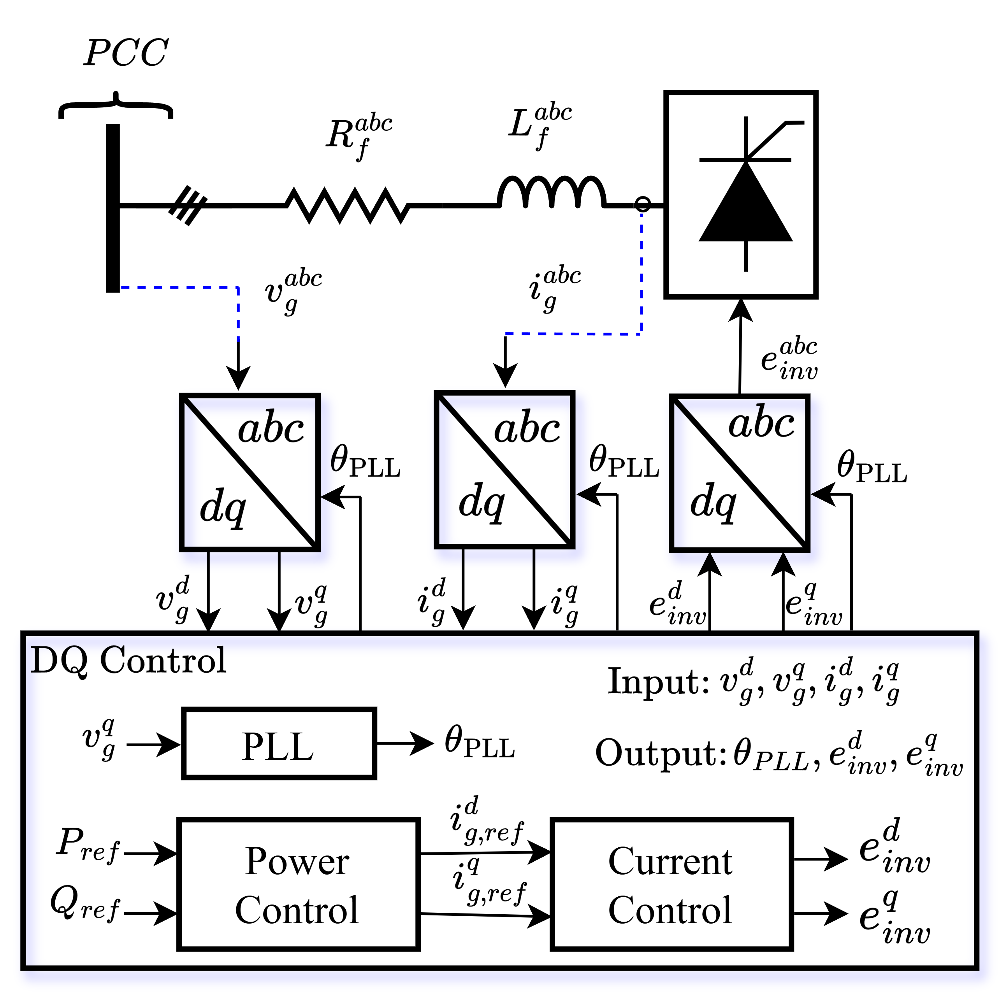

# Tutorial-Gird-following-Inverter
A comprehensive Python tutorial for simulating grid-following inverters. This project implements Differential-Algebraic Equations (DAEs) solved via the Implicit Trapezoidal Rule and use promo auto-diff to compute the Jacobian for Newton Raphson method.  There are three different operational support modes: Constant PQ, Frequency support and Volt-Var 

## System Configuration

### Network Topology
The system consists of a two-bus network:
* **Slack Bus (Grid):** An infinite bus with a fixed voltage magnitude ($V_{slack}$) and angle ($\theta_{slack}$).
* **Inverter Bus:** The point of common coupling (PCC) where the inverter is connected.

### Physical Interface
The inverter is interfaced with the grid through a **series RL filter**. The output voltage of the inverter, $v_g^{abc}$, is dynamically controlled to manage the power flow across the filter's coupling impedance to the second node.

### Control Architecture
The control system is implemented in the $dq$-reference frame and consists of:
1. **Synchronization:** A Phase-Locked Loop (PLL) to track the grid frequency and angle.
2. **Outer Power Loop:** Manages Active ($P$) and Reactive ($Q$) power setpoints.
3. **Inner Current Loop:** Fast-acting control of $i_d$ and $i_q$.


<div align="center">
  <a href="diagram/main_diagram.png">
    
  </a>
  <p align="center">
    <br>
    <code style="color: #d4af37;">Figure 1: Control block diagram layout.</code>
  </p>
</div>


## Operational Support Modes

The inverter controller is designed to be multi-functional, allowing users to toggle between three distinct modes via the `params.json` file.

### 1. Constant PQ Mode (`"mode": "PQ"`)
* **Objective:** Injects a fixed amount of active ($P$) and reactive ($Q$) power into the grid.
* **Behavior:** The controller ignores grid frequency or voltage fluctuations and maintains the setpoints defined by `Pref_const` and `Qref_const`.

### 2. Frequency Support Mode (`"mode": "FS"`)
* **Objective:** Mimics the inertial response of a synchronous generator (Frequency-Watt control).
* **Logic:** If the grid frequency deviates beyond a specified **deadband** ($f_{db}$), the inverter adjusts its active power injection according to a droop coefficient ($K_{droop,f}$).


### 3. Volt-Var Mode (`"mode": "VOLT-VAR"`)
* **Objective:** Provides local voltage regulation.
* **Logic:** The inverter monitors the terminal voltage magnitude. If it drops (under-voltage) or rises (over-voltage) beyond the deadband, the inverter injects or absorbs reactive power ($Q$) to stabilize the bus.


# How to Use the Codebase

This repository is designed to be modular and easy to execute. Follow the steps below to set up the environment and run your first simulation.

---

### 1. Environment Setup
First, ensure you have Python installed (3.8 or higher is recommended). Clone the repository and install the necessary dependencies:

```bash
# Clone the repository
git clone https://github.com/hamzaali412/Tutorial-Gird-following-Inverter.git

# Navigate to the project folder
cd Tutorial-Grid-Following-Inverter

# Install requirements
pip install -r requirements.txt

# Run the code 
python main.py
```


### Configuration & Parameter Tuning
All simulation parameters are centralized in `params.json`. You can modify the system behavior without touching the source code:

* **Mode Selection:** * Change `"mode"` to `"PQ"`, `"FS"`, or `"VOLT-VAR"`.
* **Grid Disturbance:** * Modify `"phase_jump_angle"` to test phase-locked loop (PLL) robustness.
    * Modify `"Vmag_pu"` to simulate grid voltage drops and test system resilience.
* **Droop Settings:** * Adjust `"K_droop_f"` (Frequency-Watt) or `"K_droop_v"` (Volt-Var) to change the support intensity and slope.

> **Advanced Tip:** In `main.py`, you can toggle `method="schur"`. This utilizes the Schur Complement to partition the 22x22 Jacobian matrix, solving the linear sub-problems more efficiently—a technique used in large-scale matrices and comparing the results with full-Newton Raphson.


### Repository Structure & File Descriptions


| File | Description |
| :--- | :--- |
| **`main.py`** | **Entry Point:** The top-level script that defines simulation settings and initiates the run. |
| **`params.json`** | **Configuration:** Centralized file for all system parameters, controller gains, and disturbance settings. |
| **`model_builder.py`** | **DAE Modeling:** Defines the Pyomo-based system of differential and algebraic equations. |
| **`solver.py`** | **Numerical Engine:** Implements the Full Newton-Raphson and the Schur Complement solvers. |
| **`simulation.py`** | **Execution Loop:** Manages the time-stepping logic and history storage. |
| **`controllers.py`** | **Control Logic:** Stores the residuals for the PLL, Power, and Current control loops. |
| **`config.py`** | **Setup:** Handles JSON loading, Per-Unit (PU) conversions, and grid profile generation. |
| **`initialization.py`** | **Steady-State:** Solves for initial conditions and pre-charges integrators for a smooth $t=0$ start. |
| **`helpers.py`** | **Utilities:** Contains DQ transformations, Jacobian evaluators, and numerical smoothing functions for implementing P-F and Volt-Var Curve. |


## Simulation Performance & Case Studies


<div align="center">
  <a href="diagram/constant_PQ_results.png">
    
  </a>
  <p align="center">
    <br>
    <code style="color: #d4af37;">Figure 2: Simulation results in constant PQ mode with changing grid angle.</code>
  </p>
</div>

### Citation 

If you find this tutorial helpful, please cite the following code base and tutorial available at: ttps://arxiv.org/abs/2603.19132